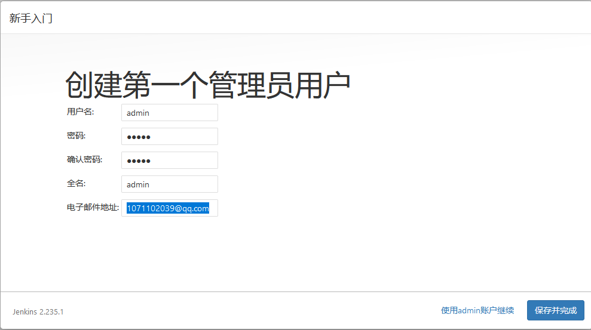

### Prerequisites

Minimum hardware requirements:
- 256 MB of RAM
- 1 GB of drive space (although 10 GB is a recommended minimum if running Jenkins as a Docker container)
Recommended hardware configuration for a small team:
- 1 GB+ of RAM
- 50 GB+ of drive spac
Sofware requirements:
- Java 8 - either a Java Runtime Environment (JRE) or a Java Development Kit (JDK) is fine
> Note:This is not a requirement if running Jenkins as a Docker container.

```

```


### Installation Jenkins

**platforms**

```
~]# cat /etc/redhat-release
CentOS Linux release 7.6.1810 (Core)
```

**jdk**

```
~]# yum install  java-1.8.0-openjdk java-1.8.0-openjdk-devel git
~]# java -version
openjdk version "1.8.0_252"
OpenJDK Runtime Environment (build 1.8.0_252-b09)
OpenJDK 64-Bit Server VM (build 25.252-b09, mixed mode)
```

**jenkins**

```
 ~]# wget https://mirrors.tuna.tsinghua.edu.cn/jenkins/redhat-stable/jenkins-2.235.1-1.1.noarch.rpm
 ~]# rpm -ivh jenkins-2.235.1-1.1.noarch.rpm
```

**start**

```
~]# systemctl  stop firewalld
~]# systemctl  disable firewalld
~]# setenforce  0
~]# /etc/init.d/jenkins  start
```

**Post-installation setup wizard**

- Unlocking Jenkins

```
~]# cat /var/lib/jenkins/secrets/initialAdminPassword
baf45e805cf04e76a39cc06a8dc90cc3
```

- Customizing Jenkins with plugins

  - Install suggested plugins.

> Installation of Jenkins Can't Connect to Install Plug-ins to Solve the Problem:
```
cd $JENKINS_HOME/updates
sed -i 's/http:\/\/updates.jenkins-ci.org\/download/https:\/\/mirrors.tuna.tsinghua.edu.cn\/jenkins/g' default.json && \
sed -i 's/http:\/\/www.google.com/https:\/\/www.baidu.com/g' default.json
```



- [官方文档](https://pkg.jenkins.io/redhat-stable/)
- [wiki](https://www.jenkins.io/doc/book/installing/#red-hat-centos)
